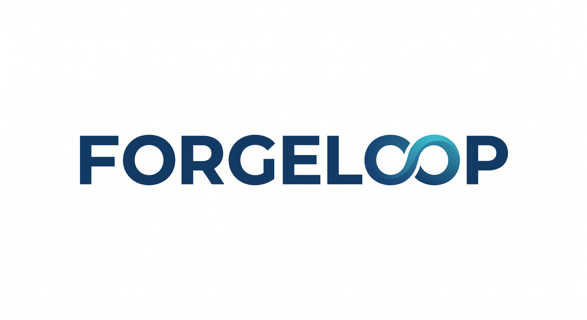

# ForgeLoop

<p align="center">
  
</p>

**Gated workflow skills for agentic planning, implementation, review, and repair.**

ForgeLoop is a portable Claude/Codex workflow pack for teams that want agentic coding
to behave like a disciplined engineering process: source checks first, test-driven
implementation, reviewer gates, external review, bounded repair loops, and explicit
approval before commit.

Three workflows are now shipped: **`plan-loop`**, **`implement-loop`**, and
**`debug-loop`**. More workflow skills can live beside them under the same structure.

---

## Why ForgeLoop

ForgeLoop is built for research-heavy engineering, where the source of truth may be a
paper, a reference implementation, an official spec, a repo contract, or an explicit
experimental decision. It takes inspiration from the useful parts of Superpowers, but is
structured for workflows where technical intent, evidence, and reproducibility matter more
than fast code generation.

The failure mode it targets is common in agentic coding: a model produces a confident
implementation without grounding it in the right source, skips the regression test, or
chooses a path through an ambiguous requirement without asking. ForgeLoop avoids relying
on one model in isolation. Claude works inside a strict planning, implementation, or
debugging loop; Codex acts as an independent outer reviewer. The loop iterates until the
plan, code, tests, and review evidence converge.

The human remains the authority for intent and tradeoffs. You define the sources of truth,
constraints, and acceptance criteria. When requirements are ambiguous, sources conflict, or
a decision point is underspecified, ForgeLoop stops and asks instead of guessing.

ForgeLoop turns those steps into a repeatable loop:

```text
source check -> TDD implementation -> coverage gate -> reviewer gate
             -> Codex review -> repair plan -> approval gate
```

It is designed for high-stakes repos where "looks good" is not enough.

## What You Get

- **`plan-loop` skill**: a gated planning loop that validates requirements, maps source
  authority, forces user-only decision resolution, generates a complete plan, self-checks
  it, passes it through internal and Codex review, and waits for approval before handing
  off to `implement-loop`.
- **`implement-loop` skill**: a bounded TDD implementation loop with up to five repair
  iterations.
- **`debug-loop` skill**: a gated bug investigation loop that validates symptoms,
  maps evidence authority, requires reproduction before hypothesis, requires trace-backed
  root cause before handoff, and produces a complete `implement-loop` task. v1 is
  handoff-only — it does not edit code.
- **`cluster-loop` skill**: a SLURM cluster allocation skill that surveys the full
  allocation map (sinfo + squeue + ps), recommends available nodes, allocates via
  `salloc --no-shell` inside an auto-created tmux session so the allocation survives
  disconnects, and runs `srun` inside the active allocation.
- **Reliable-source check**: blocks implementation when the plan conflicts with the
  paper, spec, official docs, or repo contracts.
- **Developer handoff contract**: requires RED, GREEN, full-suite, and coverage evidence.
- **Five reviewer roles**: correctness, security, performance, standards, and slop.
- **Codex outer gate**: required by default, configurable only through explicit repo
  policy.
- **Repair discipline**: failed review findings become scoped repair plans before code
  changes continue.
- **Convergence reports**: clear approval gate before staging or committing.

## Repo Layout

```text
forgeloop/
  skill/.claude/                  # installable Claude payload
    skills/implement-loop.md
    skills/implement-loop/
    skills/plan-loop.md
    skills/plan-loop/
    skills/debug-loop.md
    skills/debug-loop/
    skills/cluster-loop.md
    skills/cluster-loop/
    agents/
    AGENTS.template.md
    CLAUDE.template.md
  templates/                      # copyable task/report templates
  tests/                          # skill-text enforcement checks
  docs/                           # adaptation and setup notes
  examples/                       # tiny examples for learning the loop
  scripts/install.sh              # copies the payload into another repo
```

## Quick Start

From a target repo:

```bash
git clone https://github.com/<your-user>/forgeloop.git /tmp/forgeloop
/tmp/forgeloop/scripts/install.sh .
```

The installer refuses to overwrite existing `.claude` files by default. Run with
`--dry-run` first if you want to inspect what would be copied.

Then ask Claude:

```text
Use the implement-loop skill.

Implement this task:
<task file or acceptance criteria>
```

For best results, give the loop a task file with context, acceptance criteria, test
expectations, and verification commands. Start from `templates/task-plan.md`.

## The Debug Loop

`debug-loop` follows eight stages:

1. **Stage 0: Load Symptom**
   Resolve the bug report or inline symptom description.

2. **Stage 1: Symptom Validation**
   Ask the user for observed behavior, expected behavior, environment, reproduction
   inputs, constraints, and success criteria. No analysis starts until the user answers.

3. **Stage 2: Evidence Source Map**
   Rank runtime evidence, specs/contracts, dependency behavior, and data shape.
   Conflicts require user resolution — no autonomous choices.

4. **Stage 3: Reproduction Gate**
   Establish a deterministic reproduction (failing test, failing command, log trace, or
   manual repro). Hypothesis generation is blocked until RED evidence is confirmed.

5. **Stage 4: Hypothesis and Root-Cause Trace**
   Form evidence-backed hypotheses. Require trace evidence to a file/line, config,
   runtime evidence, dependency behavior, or data shape. Fix handoff is blocked until
   `ROOT_CAUSE: TRACED`.

6. **Stage 5: Debug Handoff Generation**
   Produce an `implement-loop` task using the canonical schema: `CONTEXT`, `WHAT_TO_DO`,
   `TESTS`, `VERIFY`, and `CHECKLIST`. v1 does not edit code.

7. **Stage 6: Self-Check and Reviewer Gate**
   Verify RED evidence, trace completeness, handoff schema, scope discipline, and
   regression test presence. Then Codex review. Blocking findings enter the repair loop.

8. **Stage 7: Approval Gate**
   Report the debug report path. Wait for explicit user approval before handing off to
   `implement-loop`.

Then ask Claude to debug first:

```text
Use the debug-loop skill.

Investigate this bug:
<symptom description or bug report file>
```

Start from `templates/debug-loop-report.md` to see the required report format.

## The Plan Loop

`plan-loop` follows eight stages:

1. **Stage 0: Load Request**  
   Resolve the request file or inline description and extract the raw goal.

2. **Stage 1: Requirements Validation**  
   Ask the user targeted questions (goal, non-goals, constraints, success criteria).
   Plan generation is blocked until the user answers.

3. **Stage 2: Reliable-Source Map**  
   List, rank, and approve all authoritative sources. Conflicting sources stop the loop
   and require a user decision.

4. **Stage 3: Decision Gate**  
   Surface every unresolved decision. The user resolves each one. No autonomous choices.

5. **Stage 4: Plan Generation**  
   Write the plan using only validated requirements, approved sources, and explicit user
   decisions. No new sources may be introduced here.

6. **Stage 5: Plan Self-Check**  
   Verify requirement coverage, source traceability, no unresolved decisions, no
   placeholders, and signature consistency.

7. **Stage 6: Reviewer Gate**  
   Internal passes (completeness, traceability, consistency, feasibility, handoff),
   then Codex review. Blocking findings enter the repair loop.

8. **Stage 7: Approval Gate**  
   Report the final plan path. Wait for explicit user approval before handing off to
   `implement-loop`.

Then ask Claude to plan first:

```text
Use the plan-loop skill.

Plan this feature:
<description or request file>
```

Start from `templates/plan-loop-plan.md` to see the required plan format.

## The Implement Loop

`implement-loop` follows six stages:

1. **Stage 0: Load Task**  
   Resolve the task file or inline criteria and extract context, tests, verification,
   and checklist.

2. **Stage 0.5: Reliable-Source Check**  
   A read-only source-check pass compares the plan to authoritative sources and repo
   contracts. Conflicts stop the loop.

3. **Stage A: Developer TDD Pass**  
   Write failing tests, implement the smallest passing change, run the full suite, and
   report coverage.

4. **Stage B: Reviewer Gate**  
   Review the actual changed files with focused reviewers. Blocking findings produce a
   repair brief.

5. **Stage C: Codex Gate**  
   Run an outer review using Codex CLI. A failed verdict enters the repair loop.
   If your repo cannot use Codex, explicitly edit the policy before treating the loop as
   converged.

6. **Stage D: Approval Gate**  
   When all gates pass, ForgeLoop reports exactly what changed and waits for human
   approval before commit.

## Philosophy

ForgeLoop is intentionally strict:

- Plans are context, not truth.
- Generated docs and prior AI reviews are not algorithm authority.
- Test evidence is part of the deliverable.
- Repair iterations must stay inside scope.
- Results and generated artifacts are never edited by hand unless your repo policy says
  otherwise.
- The human chooses when to commit.

## Requirements

- Claude Code or a compatible Claude workflow that can read `.claude/skills/`.
- A repo with tests runnable from the command line.
- Codex CLI for the default outer review gate.

If Codex CLI is unavailable, keep the loop's Stage C policy explicit for your team. Do not
silently treat an unavailable outer review as a pass.

## What Gets Installed

```text
.claude/
  skills/implement-loop.md
  skills/implement-loop/*.md
  skills/plan-loop.md
  skills/plan-loop/*.md
  skills/debug-loop.md
  skills/debug-loop/*.md
  skills/debug-loop/dap_client.py   # stdlib-only DAP debugger client (Stage 4)
  agents/developer.md
  agents/source-check.md
  agents/tester.md
  agents/reviewer-*.md
  AGENTS.template.md
  CLAUDE.template.md
```

## Before First Use

Adapt these repo-specific settings:

- authoritative specs, papers, and official docs;
- full-suite and targeted test commands;
- forbidden generated artifact paths;
- Codex model and command;
- coverage threshold;
- reviewer notes for your domain.

## Limitations

ForgeLoop is not a CI system and does not replace human approval. It is a workflow
contract for an agent. It needs repo-specific tuning before it should be trusted on
large or high-risk changes.

## Add More Loops

ForgeLoop is meant to grow:

```text
skill/.claude/skills/
  implement-loop.md
  plan-loop.md
  review-loop.md
  debug-loop.md
```

Keep each loop small, explicit, and gate-driven. Put reusable stage details in a sibling
folder, just like `implement-loop/`.

## Status

Early release extracted from internal engineering workflows. The packaged skill is
intentionally plain Markdown so it is easy to audit, fork, and adapt.
