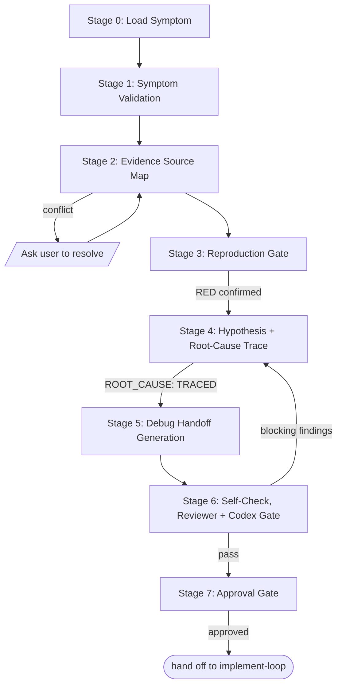
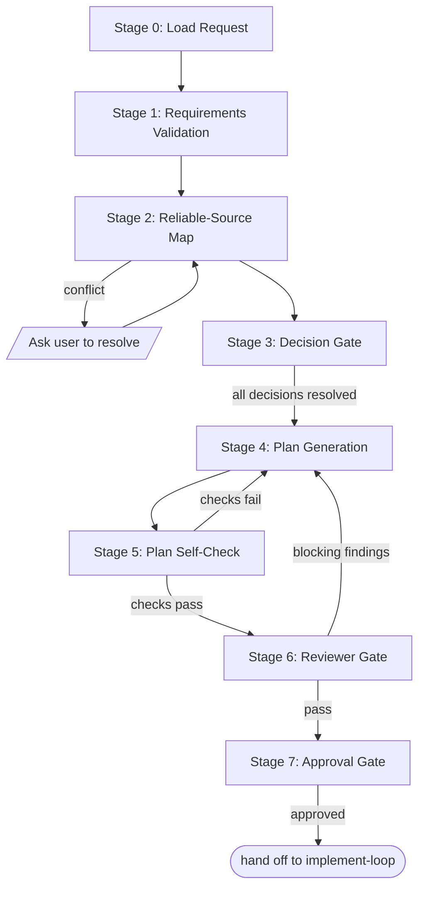
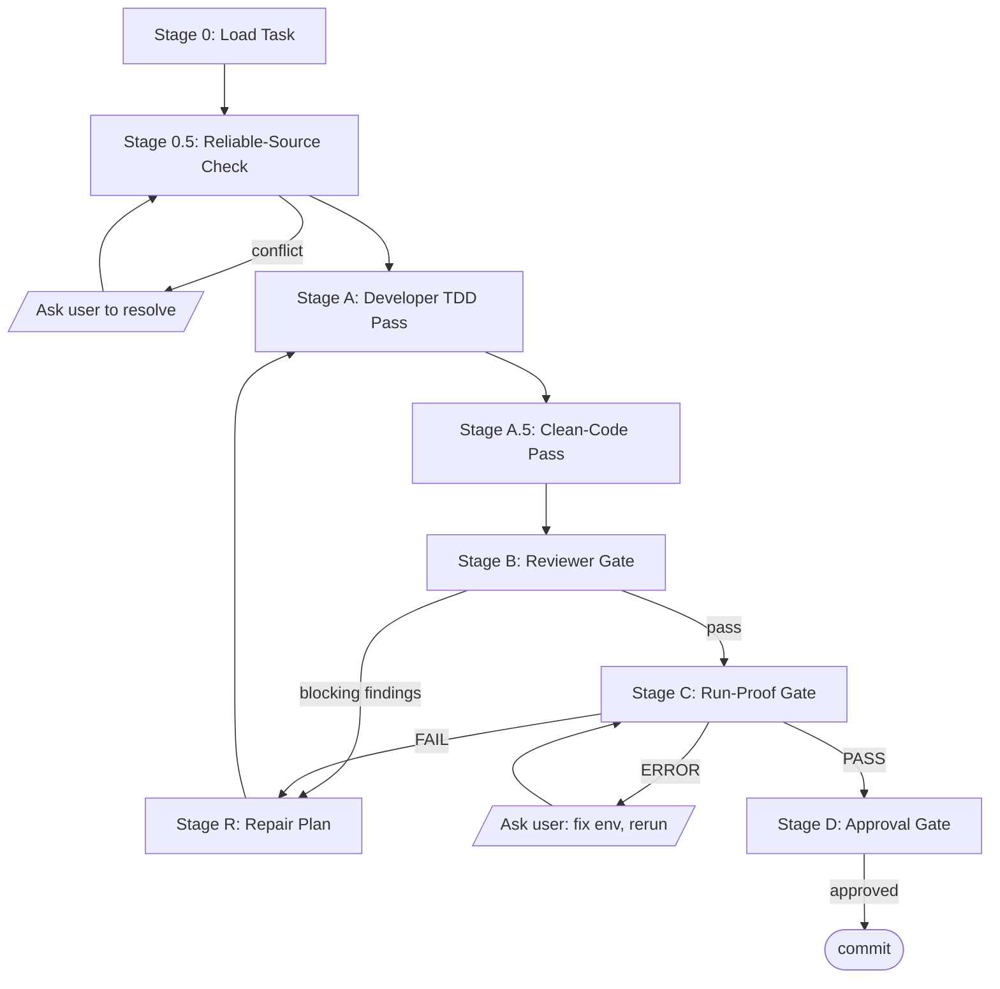

# ForgeLoop

<p align="center">
  
</p>

**Gated workflow skills for agentic planning, implementation, review, and repair.**

**Current version: 0.13.1** (see [`CHANGELOG.md`](CHANGELOG.md) for release notes; the
version of record is `.claude-plugin/plugin.json`).

ForgeLoop is a portable Claude/Codex workflow pack for teams that want agentic coding
to behave like a disciplined engineering process: source checks first, test-driven
implementation, reviewer gates, external review, bounded repair loops, and explicit
approval before commit.

Three workflows are now shipped: **`plan-loop`**, **`implement-loop`**, and
**`debug-loop`**. More workflow skills can live beside them under the same structure.

---

## Why ForgeLoop

ForgeLoop is built for research-heavy engineering, where the source of truth may be a
paper, a reference implementation, an official spec, a repo contract, or an explicit
experimental decision. It takes inspiration from the useful parts of Superpowers, but is
structured for workflows where technical intent, evidence, and reproducibility matter more
than fast code generation.

The failure mode it targets is common in agentic coding: a model produces a confident
implementation without grounding it in the right source, skips the regression test, or
chooses a path through an ambiguous requirement without asking. ForgeLoop avoids relying
on review alone. Claude works inside a strict planning, implementation, or debugging
loop; implemented code must then prove itself in a real CPU or GPU run, and debug
reports get an independent Codex review. The loop iterates until the plan, code, tests,
and run evidence converge.

The human remains the authority for intent and tradeoffs. You define the sources of truth,
constraints, and acceptance criteria. When requirements are ambiguous, sources conflict, or
a decision point is underspecified, ForgeLoop stops and asks instead of guessing.

ForgeLoop turns those steps into a repeatable loop:

```text
source check -> TDD implementation -> coverage gate -> clean-code pass -> reviewer gate
             -> CPU/GPU run proof -> repair plan -> approval gate
```

It is designed for high-stakes repos where "looks good" is not enough.

## What You Get

- **`cost-heatmap` skill**: not a gated loop; a one-shot report. Builds an interactive
  heat map of your Claude Code and Codex token usage and list-price cost from local
  transcripts (topic, tool, project, model, recurring jobs, run-rate, savings levers),
  refreshed in the background every session. See
  [docs/cost-heatmap.md](docs/cost-heatmap.md).
- **Live session cost**: a mod (`hooks/session_cost.tsx`) shows `Session $1.84 · ctx 41%`
  above the prompt after every turn (also in the terminal status line), from the engine's
  own session totals, the same figures `/cost` reports.
- **`plan-loop` skill**: a gated planning loop that validates requirements, maps source
  authority, forces user-only decision resolution, generates a complete plan, self-checks
  it, passes it through internal review, and waits for approval before handing off to
  `implement-loop`. Every plan hands off a concrete `RUN_PROOF`.
- **`implement-loop` skill**: a bounded TDD implementation loop with up to five repair
  iterations that only converges after a real CPU/GPU run proves the change works.
- **`debug-loop` skill**: a gated bug investigation loop that validates symptoms,
  maps evidence authority, requires reproduction before hypothesis, requires trace-backed
  root cause before handoff, and produces a complete `implement-loop` task. v1 is
  handoff-only — it does not edit code.
- **`cluster-loop` skill**: a SLURM cluster allocation skill that surveys the full
  allocation map (sinfo + squeue + ps), recommends available nodes, allocates via
  `salloc --no-shell` inside an auto-created tmux session so the allocation survives
  disconnects, and runs `srun` inside the active allocation.
- **Reliable-source check**: blocks implementation when the plan conflicts with the
  paper, spec, official docs, or repo contracts. Declare them once in
  `.claude/forgeloop.md`'s `Sources` section instead of restating ranking rules per
  task or in `CLAUDE.md`.
- **Developer handoff contract**: requires RED, GREEN, full-suite, and coverage evidence.
- **Clean-code pass**: a fresh-context `refactorer` agent simplifies the changed
  production code before review, behavior-preserving (tests untouched, suite green),
  with separate feature and refactor patches. Adapted from `code-simplification`
  (addyosmani/agent-skills) and `code-simplifier` (Anthropic).
- **Three reviewer agents**: `reviewer-correctness` and `reviewer-security` standalone,
  plus `reviewer-hygiene` covering conventions, scope, dead code, and performance in
  one dispatch — three reviewer dispatches instead of five on the full gate.
- **`explorer` agent**: a cheap, read-only (`Read, Grep, Glob`, `model: haiku`),
  citations-only broad-search dispatch for the one undirected-search moment in each of
  `implement-loop` (Stage A), `plan-loop` (Stage 2), and `debug-loop` (Stage 4) — only
  fires when the task doesn't already name an exact location, and its citations are a
  starting point the dispatching agent must confirm itself, never trace-evidence or a
  reviewer input on their own.
- **Git-diff-narrowed repair scope**: repair iterations (`implement-loop`'s Stage R and
  Stage A.5) get a precise, per-iteration file list computed from persisted git tree
  snapshots — what the *previous* repair pass actually touched — instead of
  rediscovering scope or diffing cumulatively against the task's starting commit. It's
  a soft starting point, never a hard restriction: a fix that genuinely needs one more
  file can still add it, with a one-line reason.
- **Clean-tree precondition**: `implement-loop` needs a clean working tree at start
  (Stage 0 checks it), because `HEAD` is the baseline for iteration 1's scope and Stage
  B's file list. If not, it stops and lists the paths: commit or stash them first, then
  re-run. It never auto-commits or auto-stashes, and ForgeLoop's own artifacts under
  `.claude/clean-code/`, `.claude/run-proofs/`, `.claude/plans/` and
  `.claude/debug-reports/` never trigger it.
- **Run-proof gate**: `implement-loop` runs the task's `RUN_PROOF` command locally
  (CPU) or inside a SLURM allocation via `cluster-loop` (GPU), and judges every pass
  criterion against quoted log evidence.
- **Codex outer gate (`debug-loop`)**: independent review of debug reports and
  handoffs.
- **Repair discipline**: failed review findings become scoped repair plans before code
  changes continue.
- **Convergence reports**: clear approval gate before staging or committing.

## Repo Layout

ForgeLoop is a Claude Code plugin; this repo is the plugin and its own
marketplace. It's also distributed to the DriveNets team via the `gpu-team`
marketplace (`plugins/forgeloop/` in `drivenets/dn-ai-plugins-marketplace`).

```text
plugins/forgeloop/
  .claude-plugin/
    plugin.json                   # plugin manifest (name, version)
  skills/                         # one directory per skill
    implement-loop/SKILL.md       # + clean-code.md, run-proof.md, review-gates.md, ...
    plan-loop/SKILL.md
    debug-loop/SKILL.md           # + debugger.md, dap_client.py, ...
    cluster-loop/SKILL.md
    codex-model-check/SKILL.md
    cost-heatmap/SKILL.md         # + cost_heatmap.py, dashboard.template.html
  agents/                         # developer, refactorer, explorer, source-check, reviewer-*
  templates/                      # task/report templates, forgeloop.md repo config,
                                  # AGENTS/CLAUDE templates
  tests/                          # skill-text and packaging checks
  docs/                           # installation, configuration, adaptation
  examples/                       # tiny examples for learning the loop
  scripts/install.sh              # non-plugin install into a repo's .claude/
```

## Quick Start

Install the plugin in Claude Code:

```text
/plugin marketplace add yhadad-dn/forgeloop
/plugin install forgeloop@forgeloop
```

Then add repo settings (test commands, coverage threshold, forbidden paths):

```bash
mkdir -p .claude && cp <forgeloop>/templates/forgeloop.md .claude/forgeloop.md
```

Without the plugin system (or for Codex), copy the files into a repo instead:

```bash
git clone https://github.com/yhadad-dn/forgeloop.git /tmp/forgeloop
/tmp/forgeloop/scripts/install.sh .
```

The installer refuses to overwrite existing `.claude` files by default. Run with
`--dry-run` first if you want to inspect what would be copied. See
`docs/installation.md` for details.

Then ask Claude:

```text
/forgeloop:implement-loop

Implement this task:
<task file or acceptance criteria>
```

For best results, give the loop a task file with context, acceptance criteria, test
expectations, and verification commands. Start from `templates/task-plan.md`.

## The Debug Loop

`debug-loop` follows eight stages:


```mermaid
flowchart TD
    S0["Stage 0: Load Symptom"] --> S1["Stage 1: Symptom Validation"]
    S1 --> S2["Stage 2: Evidence Source Map"]
    S2 -->|conflict| ASK1[/"Ask user to resolve"/]
    ASK1 --> S2
    S2 --> S3["Stage 3: Reproduction Gate"]
    S3 -->|RED confirmed| S4["Stage 4: Hypothesis + Root-Cause Trace"]
    S4 -->|ROOT_CAUSE: TRACED| S5["Stage 5: Debug Handoff Generation"]
    S5 --> S6["Stage 6: Self-Check, Reviewer + Codex Gate"]
    S6 -->|blocking findings| S4
    S6 -->|pass| S7["Stage 7: Approval Gate"]
    S7 -->|approved| DONE(["hand off to implement-loop"])
```

1. **Stage 0: Load Symptom**
   Resolve the bug report or inline symptom description.

2. **Stage 1: Symptom Validation**
   Ask the user for observed behavior, expected behavior, environment, reproduction
   inputs, constraints, and success criteria. No analysis starts until the user answers.

3. **Stage 2: Evidence Source Map**
   Rank runtime evidence, specs/contracts, dependency behavior, and data shape.
   Conflicts require user resolution — no autonomous choices.

4. **Stage 3: Reproduction Gate**
   Establish a deterministic reproduction (failing test, failing command, log trace, or
   manual repro). Hypothesis generation is blocked until RED evidence is confirmed.

5. **Stage 4: Hypothesis and Root-Cause Trace**
   Form evidence-backed hypotheses. Require trace evidence to a file/line, config,
   runtime evidence, dependency behavior, or data shape. Fix handoff is blocked until
   `ROOT_CAUSE: TRACED`. Dispatches `explorer` when a hypothesis names a symptom but
   not a location; an explorer citation alone never satisfies the trace-evidence
   requirement — the dispatching agent confirms it by reading the cited range itself.

6. **Stage 5: Debug Handoff Generation**
   Produce an `implement-loop` task using the canonical schema: `CONTEXT`, `WHAT_TO_DO`,
   `TESTS`, `VERIFY`, and `CHECKLIST`. v1 does not edit code.

7. **Stage 6: Self-Check and Reviewer Gate**
   Verify RED evidence, trace completeness, handoff schema, scope discipline, and
   regression test presence. Then Codex review. Blocking findings enter the repair loop.

8. **Stage 7: Approval Gate**
   Report the debug report path. Wait for explicit user approval before handing off to
   `implement-loop`.

Then ask Claude to debug first:

```text
/forgeloop:debug-loop

Investigate this bug:
<symptom description or bug report file>
```

Start from `templates/debug-loop-report.md` to see the required report format.

## The Plan Loop

`plan-loop` follows eight stages:


```mermaid
flowchart TD
    P0["Stage 0: Load Request"] --> P1["Stage 1: Requirements Validation"]
    P1 --> P2["Stage 2: Reliable-Source Map"]
    P2 -->|conflict| ASK1[/"Ask user to resolve"/]
    ASK1 --> P2
    P2 --> P3["Stage 3: Decision Gate"]
    P3 -->|all decisions resolved| P4["Stage 4: Plan Generation"]
    P4 --> P5["Stage 5: Plan Self-Check"]
    P5 -->|checks fail| P4
    P5 -->|checks pass| P6["Stage 6: Reviewer Gate"]
    P6 -->|blocking findings| P4
    P6 -->|pass| P7["Stage 7: Approval Gate"]
    P7 -->|approved| DONE(["hand off to implement-loop"])
```

1. **Stage 0: Load Request**  
   Resolve the request file or inline description and extract the raw goal.

2. **Stage 1: Requirements Validation**  
   Ask the user targeted questions (goal, non-goals, constraints, success criteria).
   Plan generation is blocked until the user answers.

3. **Stage 2: Reliable-Source Map**  
   List, rank, and approve all authoritative sources. Conflicting sources stop the loop
   and require a user decision. Dispatches `explorer` when ranking needs repo-wide
   candidates the request doesn't already name.

4. **Stage 3: Decision Gate**  
   Surface every unresolved decision. The user resolves each one. No autonomous choices.

5. **Stage 4: Plan Generation**  
   Write the plan using only validated requirements, approved sources, and explicit user
   decisions. No new sources may be introduced here.

6. **Stage 5: Plan Self-Check**  
   Verify requirement coverage, source traceability, no unresolved decisions, no
   placeholders, and signature consistency.

7. **Stage 6: Reviewer Gate**  
   Internal passes (completeness, traceability, consistency, feasibility, handoff).
   Blocking findings enter the repair loop.

8. **Stage 7: Approval Gate**  
   Report the final plan path. Wait for explicit user approval before handing off to
   `implement-loop`.

Then ask Claude to plan first:

```text
/forgeloop:plan-loop

Plan this feature:
<description or request file>
```

Start from `templates/plan-loop-plan.md` to see the required plan format.

## The Implement Loop

`implement-loop` follows seven stages:


```mermaid
flowchart TD
    I0["Stage 0: Load Task"] --> I05["Stage 0.5: Reliable-Source Check"]
    I05 -->|conflict| ASK1[/"Ask user to resolve"/]
    ASK1 --> I05
    I05 --> A["Stage A: Developer TDD Pass"]
    A --> A5["Stage A.5: Clean-Code Pass"]
    A5 --> B["Stage B: Reviewer Gate"]
    B -->|blocking findings| SR["Stage R: Repair Plan"]
    SR --> A
    B -->|pass| C["Stage C: Run-Proof Gate"]
    C -->|FAIL| SR
    C -->|ERROR| ASK2[/"Ask user: fix env, rerun"/]
    ASK2 --> C
    C -->|PASS| D["Stage D: Approval Gate"]
    D -->|approved| DONE(["commit"])
```

Up to `MAX_ITERATIONS = 5` passes through Stage R → A → A.5 → B → C before the loop
stops and writes a divergence report instead of converging.

1. **Stage 0: Load Task**  
   Resolve the task file or inline criteria and extract context, tests, verification,
   run proof, and checklist. A missing `RUN_PROOF` stops the loop; a GPU proof needs an
   active SLURM job (from the user or `/cluster-loop`).

2. **Stage 0.5: Reliable-Source Check**  
   A read-only source-check pass compares the plan to authoritative sources and repo
   contracts. Conflicts stop the loop.

3. **Stage A: Developer TDD Pass**  
   Write failing tests, implement the smallest passing change, run the full suite, and
   report coverage. Dispatches `explorer` first when the task doesn't already name an
   exact file:line; skipped when it does, or when a repair iteration's own
   previous-iteration file list already pinpoints the location (see Stage R below).

4. **Stage A.5: Clean-Code Pass**  
   A fresh `refactorer` agent simplifies only the changed production files: one change
   at a time, test files must stay byte-identical, the full suite must stay green, and
   coverage must not drop. Failing changes are restored from a snapshot; source-mirroring
   code, hot paths, and `simplify-ignore` blocks are left alone. Never fails the loop.
   On iteration N > 1, scope is computed from a persisted per-iteration git tree
   snapshot (what the *previous* repair pass touched), not a cumulative diff against the
   task's starting commit — the snapshot hash is persisted to
   `.claude/clean-code/<task>-iter<N>-tree.txt` for Stage R to read on the next
   iteration.

   **Stage R: Repair Plan** (iteration > 1, between Stage A.5 and the next Stage A)  
   Converts a failed gate's `FIX_BRIEF` into a scoped repair plan. Reads the same
   persisted tree snapshots to compute exactly what the previous repair pass touched,
   and includes that as a labeled starting point in the plan's "Exact fix scope" —
   never a hard restriction: a fix that genuinely needs one more file can still add it,
   with a one-line reason. Missing persisted state falls back to Stage B's original
   method and records the fallback, never guesses.

5. **Stage B: Reviewer Gate**  
   Review the actual changed files with focused reviewers. Blocking findings produce a
   repair brief.

6. **Stage C: Run-Proof Gate**  
   Run the task's `RUN_PROOF` command for real — locally for CPU, via
   `srun --jobid` inside the allocation for GPU (after checking the node sees the
   current working tree). Every pass criterion needs quoted log evidence. A failed run
   enters the repair loop; an environment error stops and asks the user.

7. **Stage D: Approval Gate**  
   When all gates pass, ForgeLoop reports exactly what changed and waits for human
   approval before commit.

## Session Conventions

Once installed, ForgeLoop adds its conventions to every session through a
`SessionStart` hook, so Claude answers the same way everywhere:

- **Status reports** (when you ask for one): context, what was done in plain words,
  visual progress, a cluster block from `cluster_status.py` when cluster work is
  involved, and a closing **Next:** / **What's stopping us:** / **From you:**.
- **Summaries** (when you ask for one): project context, assignment context,
  milestones with evidence, then the status format from progress onward.
- **Times** in Israel time only.

Layers, later wins: the plugin's `conventions.md` (team default), your
`~/.claude/forgeloop/conventions.md` (personal), and the `## Conventions` section of
a repo's `.claude/forgeloop.md`. Set `FORGELOOP_CONVENTIONS=off` to disable.

**Answer style (opt-in):** Claude can write every chat reply in ASD-STE100 Simplified
Technical English: short sentences, active voice, one word per meaning, no idioms, and
no hidden risks. It is off by default. Turn it on with `FORGELOOP_STYLE=ste` or by
putting `ste` on the first line of `~/.claude/forgeloop/style`. The rules are in
[`styles/ste.md`](styles/ste.md). They apply to chat replies only, not to code,
commands, or commit messages.

## Setup and Team Rollout

ForgeLoop needs no manual settings changes. Every feature works out of the box, and each
one has an off switch or a file under `~/.claude/forgeloop/`:

| Feature | Needs settings? | Off switch or file |
|---------|-----------------|--------------------|
| Session conventions (`SessionStart` hook) | No | `FORGELOOP_CONVENTIONS=off`; personal layer `~/.claude/forgeloop/conventions.md` |
| ASD-STE100 answer style | No (opt-in) | `FORGELOOP_STYLE=ste` or `~/.claude/forgeloop/style`; off by default |
| Cost heat map refresh (background hook) | No | `FORGELOOP_COST_HEATMAP=off` |
| Session cost band (mod) | Only on Claude Code older than 2.1.287: `env.CLAUDE_CODE_ENABLE_FUNCTION_HOOKS="1"` | `FORGELOOP_COST_BAND=off` |
| Setup hint (one line, once per version) | No | `FORGELOOP_SETUP_HINT=off` |
| Skills and agents (`plan-loop`, `implement-loop`, `debug-loop`, `cluster-loop`, ...) | No | Not loaded unless invoked; nothing to switch off |

**Setup.** Run `/forgeloop:setup` in a session. It prints the exact changes to
`~/.claude/settings.json` (the env flag for an old CLI, the plugin entries
`extraKnownMarketplaces.forgeloop` and `enabledPlugins`), asks for approval, then writes
with a timestamped backup (`settings.json.forgeloop-bak-<UTC time>`). The ASD-STE100 style
file is created only if you opt in. `/forgeloop:setup --check` writes nothing. You can
also run the script in a terminal: `python3 skills/setup/forgeloop_setup.py plan`, then
`apply` (add `--ste` for the style). It only adds absent keys, never changes an existing
value, and refuses to touch a settings file that is not strict JSON.

**Setup hint.** On the first session after each ForgeLoop version, the `SessionStart`
hook runs the same check read-only. If something is pending, it adds one line to the
session: "ForgeLoop: settings need a one-time check. Run /forgeloop:setup." It tracks the
version in `~/.claude/forgeloop/setup-stamp`, never writes `settings.json`, and does
nothing if `claude --version` fails or takes over 2 s. Set `FORGELOOP_SETUP_HINT=off` to
disable it.

**Team rollout.** Commit this to the repo's `.claude/settings.json` so every teammate
is offered the marketplace and the plugin is enabled (`/forgeloop:setup --team-snippet`
prints it):

```json
{
  "extraKnownMarketplaces": {
    "forgeloop": { "source": { "source": "github", "repo": "yhadad-dn/forgeloop" } }
  },
  "enabledPlugins": { "forgeloop@forgeloop": true }
}
```

**Managed settings.** IT can set the same keys in managed settings, which take
precedence over user, project and local settings. ForgeLoop never writes managed
settings.

## Cluster Status

```bash
python3 skills/cluster-loop/cluster_status.py --job <id> [--log <run log>]   # or --mine
```

One row per job: progress, finish time next to the allocation's expiry, and a state
(`✓ on track`, `⚠ killed before done`, `⚠ stalled`, ...), plus a compact GPU line per
node and warnings with a proposed action. `--detail` adds per-GPU numbers,
processes, containers, and disk. Built for speed: one SLURM round trip, parallel
node probes, reused ssh, short caches. Also available as
`/forgeloop:cluster-loop status`.

## Philosophy

ForgeLoop is intentionally strict:

- Plans are context, not truth.
- Generated docs and prior AI reviews are not algorithm authority.
- Test evidence is part of the deliverable.
- Repair iterations must stay inside scope.
- Results and generated artifacts are never edited by hand unless your repo policy says
  otherwise.
- A commit that leaves a referenced plan, ADR, or doc out of sync with what was
  actually built is incomplete, not merely untidy.
- The human chooses when to commit.

## Requirements

- Claude Code with plugin support, or any Claude workflow that can read `.claude/skills/`.
- A repo with tests runnable from the command line.
- For GPU run proofs: a SLURM cluster reachable through `cluster-loop`.
- Codex CLI for the `debug-loop` outer review gate.

If Codex CLI is unavailable, keep the `debug-loop` Stage 6b policy explicit for your team.
Do not silently treat an unavailable outer review as a pass.

## What Gets Installed

As a plugin: everything under `skills/` and `agents/`, namespaced `forgeloop:`.
With `install.sh`, the same files land in the repo:

```text
.claude/
  skills/implement-loop/            # SKILL.md, clean-code.md, run-proof.md, ...
  skills/plan-loop/
  skills/debug-loop/                # includes dap_client.py (Stage 4 debugger)
  skills/cluster-loop/
  skills/codex-model-check/
  skills/cost-heatmap/              # cost_heatmap.py + dashboard template
  skills/setup/                     # forgeloop_setup.py (/forgeloop:setup)
  agents/developer.md
  agents/refactorer.md
  agents/explorer.md
  agents/source-check.md
  agents/reviewer-*.md
  forgeloop.md                      # repo configuration
  AGENTS.template.md
  CLAUDE.template.md
```

## Before First Use

Adapt these repo-specific settings (most live in `.claude/forgeloop.md` — copy from
`templates/forgeloop.md`):

- authoritative specs, papers, and official docs — the `## Sources` section;
- full-suite and targeted test commands;
- forbidden generated artifact paths;
- run-proof commands and pass criteria per task (and cluster access for GPU runs);
- Codex model and command (`debug-loop` only);
- coverage threshold;
- reviewer notes for your domain.

## Limitations

ForgeLoop is not a CI system and does not replace human approval. It is a workflow
contract for an agent. It needs repo-specific tuning before it should be trusted on
large or high-risk changes.

## Add More Loops

ForgeLoop is meant to grow:

```text
skills/
  implement-loop/SKILL.md
  plan-loop/SKILL.md
  review-loop/SKILL.md
  debug-loop/SKILL.md
```

Keep each loop small, explicit, and gate-driven. Put reusable stage details next to
`SKILL.md` in the skill's directory, just like `implement-loop/`, and reference them by
relative path.

## Status

Early release extracted from internal engineering workflows. The packaged skill is
intentionally plain Markdown so it is easy to audit, fork, and adapt.
